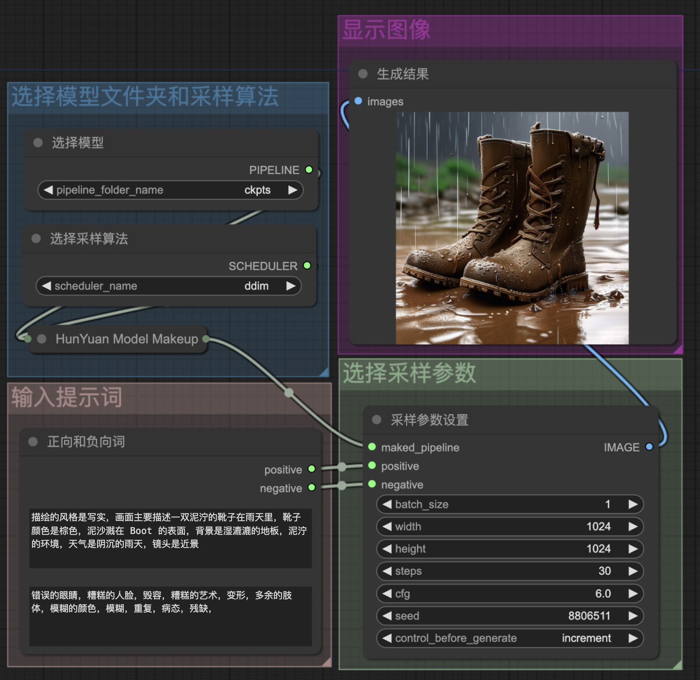

# ComfyUI-Diffusers

This repository is a custom node and workflow for HunYuan DIT.

## Overview

### Workflow text2image

This is a program that allows you to use HunyuanDiT with ComfyUI.


Workflow: [hunyuan_txt2img.json](workflow/hunyuan_txt2img.json)


## Usage

Run the following command inside ComfyUI.

```cmd
python -m pip install "huggingface_hub[cli]"
mkdir models/hunyuan
# Use the huggingface-cli tool to download the model.
# The download time may vary from 10 minutes to 1 hour depending on network conditions.
huggingface-cli download Tencent-Hunyuan/HunyuanDiT --local-dir ./models/hunyuan/ckpts
cd ./custom_nodes
git clone xxx.git
cd xxx
pip install -r requirements.txt
```


## Node

### HunYuan Pipeline Loader
### HunYuan Scheduler Loader
### HunYuan Model Makeup
### HunYuan Clip Text Encode
### HunYuan Sampler

## Reference 

### https://github.com/Limitex/ComfyUI-Diffusers
### https://github.com/Tencent/HunyuanDiT/pull/59
